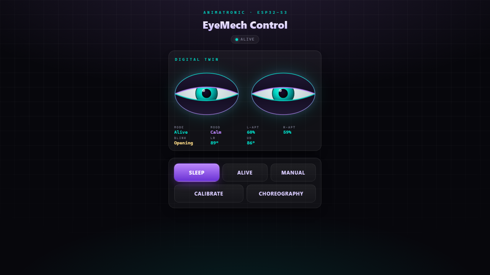
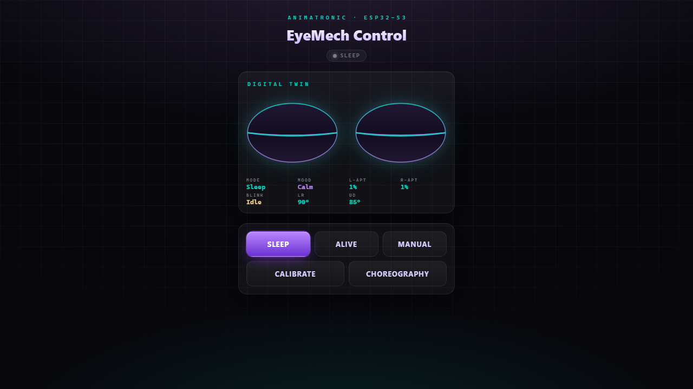
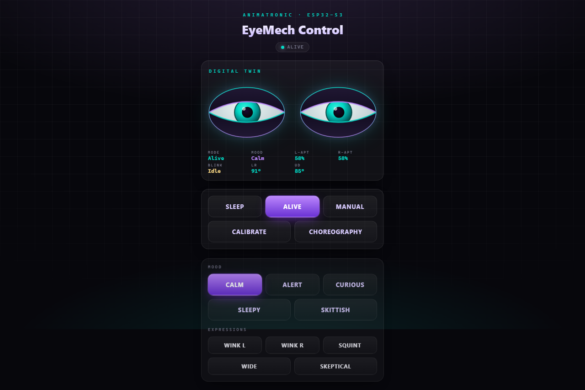
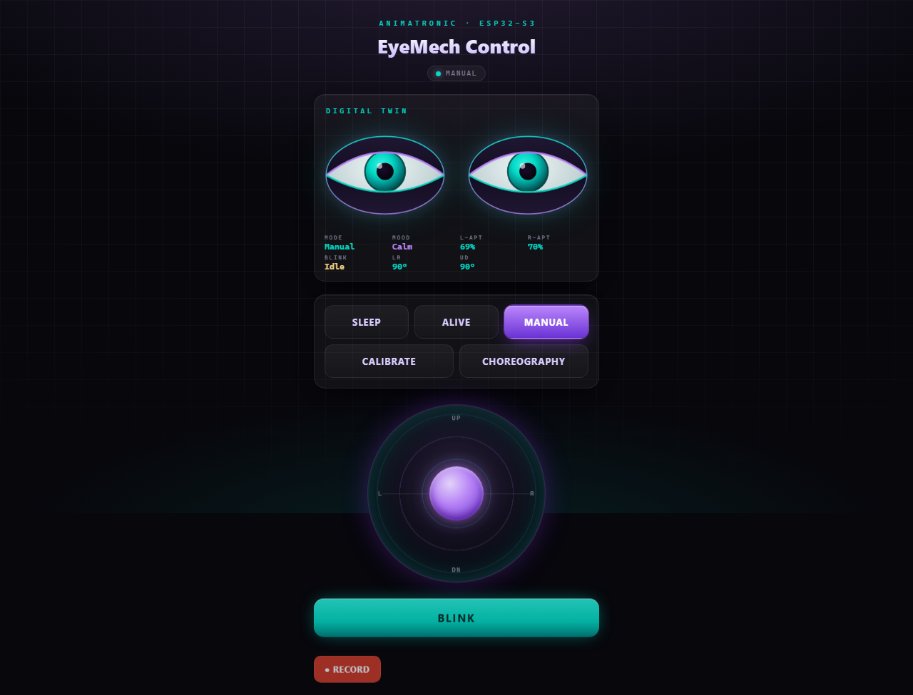
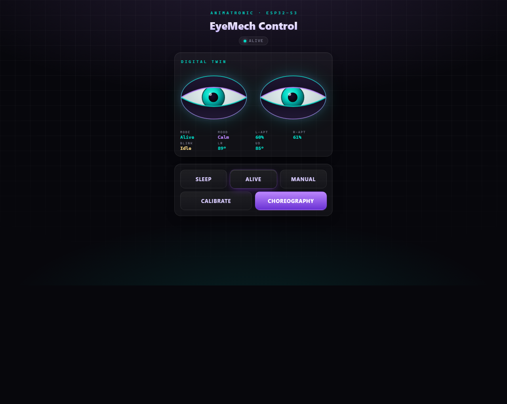
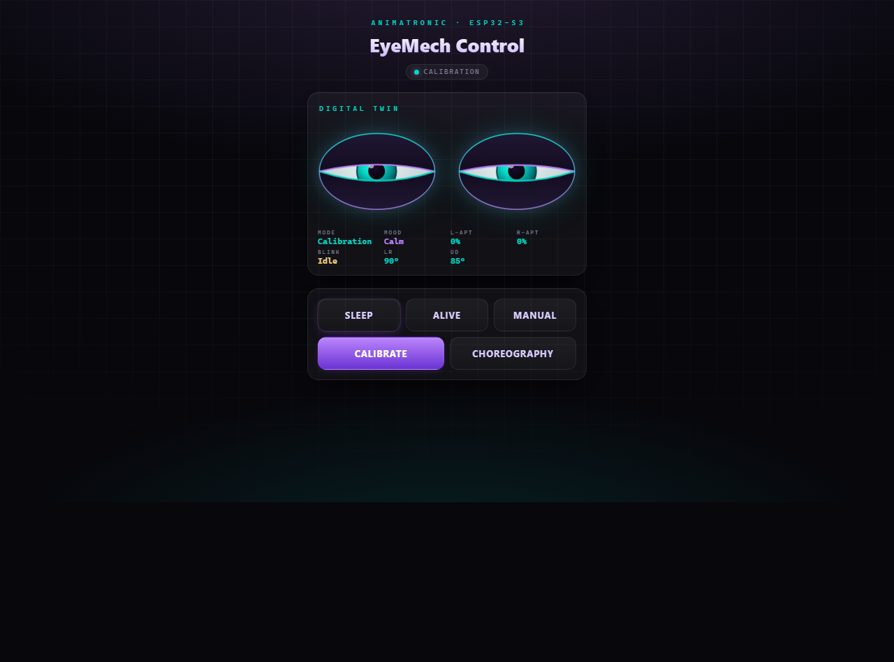
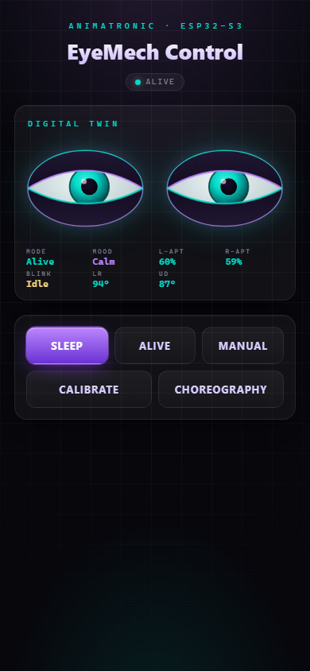

# EyeMech ε3.2 — Developer Documentation

## Overview
EyeMech ε3.2 is an advanced animatronic eye control system for the ESP32-S3. It drives six servos (Left/Right pan, Up/Down tilt, and four eyelid servos) through a PCA9685 PWM driver over I2C, and serves its own offline Web Dashboard with a live digital twin of the eyes.

The mechanism is built on **Will Cogley's animatronic eye design** — full credit for the original 3D-printed eye mechanism goes to his work. This firmware is an independent ESP32-S3 control layer for that hardware: a self-hosted wireless dashboard, a research-backed **Personality Engine** for lifelike autonomous behaviour, a **Choreography** keyframe player, and a guided **Servo Calibration Wizard** with persistent storage.

The core strength of this version is its **Digital-Twin Architecture**: the dashboard renders two independent SVG eyes that mirror the real servo state in real time over a WebSocket, so behaviour can be developed and validated with or without hardware attached.



---

## Hardware Configuration

### Core Components
* **Microcontroller:** ESP32-S3
* **PWM Driver:** PCA9685 (I2C: SDA=GPIO 4, SCL=GPIO 5)
* **Servos:** 6x standard 180° hobby servos (Pan, Tilt, and 4 eyelid servos)

### Servo Channel Map (PCA9685)
| Channel | Constant | Function |
| :--- | :--- | :--- |
| 0 | `CH_LR` | Left/Right eye pan |
| 1 | `CH_UD` | Up/Down eye tilt |
| 2 | `CH_TL` | Top-Left eyelid |
| 3 | `CH_BL` | Bottom-Left eyelid |
| 4 | `CH_TR` | Top-Right eyelid |
| 5 | `CH_BR` | Bottom-Right eyelid |

> **No physical inputs.** Earlier builds supported an analog joystick/potentiometer module; that provider has been removed. The web dashboard is now the sole control source, so the only wiring required is power, I2C, and the six servos.

---

## Operational Modes

The system runs a non-blocking state machine. The active mode is selected from the dashboard (or via the HTTP API) and reported live in `/state` as `m`.

| `m` | Mode | Behaviour |
| :--- | :--- | :--- |
| 0 | **Sleep** | Boot default. Eyes settle closed with a slow sinusoidal "breathing" aperture. Any web activity wakes the device to Alive. The system also auto-sleeps after 5 minutes of inactivity. |
| 1 | **Alive** | The Personality Engine runs autonomously: spontaneous saccades, natural blinks, mood drift, and occasional ambient choreographies. The headline mode. |
| 2 | **Manual** | Direct gaze control from the dashboard's virtual joystick. |
| 3 | **Calibration** | Holds the servos still for the guided Calibration Wizard. Calibration-mutating routes are only honoured in this mode. |
| 4 | **Perform** | Plays a choreography keyframe sequence, then returns to Alive (unless looping). |

### The Personality Engine (Alive)
Rather than fixed gestures, Alive expresses **moods** that bias gaze dynamics, blink rate, and aperture:
`Calm`, `Alert`, `Curious`, `Sleepy`, and `Skittish`. Moods drift over time via a weighted random walk for a living, non-repeating feel.

One-shot **expressions** can be fired at any time: `wink_l`, `wink_r`, `squint`, `wide`, and `skeptical`. A reactive **behaviour bus** provides higher-level events: `startle`, `greet`, `settle`, and `track` (gaze-follow a normalized target).

---

## Wireless Control (Web Dashboard)

The ESP32-S3 acts as its own wireless access point, so any phone or tablet can control it without external infrastructure or internet.

### How to Connect
1. **Scan for WiFi:** Look for the network SSID: `EyeMech-Controller`.
2. **Connect:** Use the password: `eyemech123`.
3. **Access Dashboard:** Open a browser to `http://192.168.4.1`, or `http://eyemech.local` (mDNS).

### The Web Interface
The dashboard is a responsive, touch-optimized single page served straight from flash:
* **Digital Twin:** Two independent SVG eyes mirror the real servo state in real time, with a live telemetry strip (mode, mood, per-eye aperture, blink phase, pan/tilt angles).
* **Mode Bar:** Switch between Sleep, Alive, Manual, Calibrate, and Choreography.
* **Alive Controls:** One-tap mood selection and expression macros.
* **Virtual Joystick:** A high-precision directional pad for Manual gaze.
* **Choreography Editor:** Build/edit keyframe sequences, play/loop/stop transport, ten built-in canned sequences, and browser-side save/load.
* **Calibration Wizard:** A guided 14-step flow to capture per-servo reference poses, with automatic safe-limit calculation and persistent storage.

### Dashboard Views
Every mode is its own focused view, all sharing the live digital-twin header.

| Sleep | Alive |
| :---: | :---: |
|  |  |
| Eyes breathe slowly closed; any web activity wakes the device. | Personality Engine: one-tap moods and one-shot expression macros. |

| Manual | Choreography |
| :---: | :---: |
|  |  |
| Virtual joystick for direct gaze, with manual Blink and Record. | Keyframe sequence editor with play / loop / stop transport. |

| Calibration | Responsive (390 px phone) |
| :---: | :---: |
|  |  |
| Guided 14-step wizard; servos held still while you capture poses. | The whole dashboard reflows cleanly for phone screens. |

### Real-Time Telemetry (WebSocket)
A WebSocket server on **port 81** pushes `/state` JSON to all connected clients (only on change) to drive the twin smoothly without polling.

---

## Servo Calibration & Persistence

Every servo is independently calibrated through the wizard — capturing its centre, travel endpoints, and safe limits — so the animation engine drives **calibrated angles** instead of hard-coded constants. The 14-step flow walks through the eyelids (L then R) and the gaze axes (horizontal then vertical), parking inactive servos to neutral at each step.

Calibration is persisted to the ESP32's **NVS** (non-volatile storage) via `Preferences`, so it survives power cycles. `Save`, `Revert`, and `Reset` are exposed for safe iteration.

---

## Developer API (HTTP)

The device exposes a flat HTTP API on port 80. Useful for custom controllers (Python scripts, custom apps) or automated testing.

### State & Health
* `GET /state` — live telemetry JSON: `{m, mood, a[6], bp, ap, perf}` (mode, mood, six servo angles, blink phase, aperture %, active canned index).
* `GET /health` — `{up, heap, fps}` uptime/heap/frame diagnostics.

### Mode, Mood & Expression
* `GET /mode?set=sleep|alive|manual|calibration` — switch operating mode.
* `GET /mood?set=calm|alert|curious|sleepy|skittish` — set Alive mood (also forces Alive).
* `GET /express?name=wink_l|wink_r|squint|wide|skeptical` — fire a one-shot expression.
* `GET /behavior?do=startle|greet|settle|track[&x=&y=]` — trigger a reactive behaviour (`track` requires normalized `x`,`y`).
* `GET /blink` — manual blink.

### Gaze
* `GET /update?lr=<int>&ud=<int>` — direct Manual gaze (ADC-style values around centre).
* `GET /lookat?x=<0..1>&y=<0..1>` — normalized gaze target.

### Choreography
* `POST /seq` — upload a keyframe sequence (text body, `;`-separated frames).
* `GET /play[?loop=1]` — play the loaded sequence (optionally looping).
* `GET /stop` — stop and return to Alive.
* `GET /canned?i=<0-9>` — load one of ten built-in sequences.

### Calibration *(Calibration mode only, where noted)*
* `GET /cal` — current calibration + live angles JSON.
* `GET /cal/jog?ch=&d=[&edge=1]` — nudge a channel by a delta.
* `GET /cal/go?ch=&a=` — drive a channel to an absolute angle.
* `POST /cal/set?ch=&slot=center|enda|endb|safemin|safemax` — capture the live angle into a slot. *(409 outside Calibration.)*
* `POST /cal/mirror` — seed right-eye lids from the left, reflected. *(409 outside Calibration.)*
* `POST /cal/autosafe` — auto-compute safe limits around captured endpoints. *(409 outside Calibration.)*
* `POST /cal/save` / `POST /cal/revert` — persist to / reload from NVS.
* `POST /cal/reset` — restore default calibration. *(409 outside Calibration.)*

---

## Codebase Structure
* `EyeMech.ino` — main application: WiFi AP, web + WebSocket servers, the mode state machine, Personality Engine, choreography player, calibration, and NVS persistence.
* `WebInterface.h` — the embedded HTML/CSS/JS payload for the dashboard and digital twin (streamed from PROGMEM).
* `EyeMath.h` — gaze/aperture math helpers (host-testable).
* `InputProvider.h` — the `WebInputProvider` that holds the latest dashboard gaze values.
* `PCA9685.h` / `PCA9685.cpp` — low-level driver for the PWM expander over I2C.

---

## Build & Flash
* **Toolchain:** `arduino-cli` with the `esp32:esp32` core, FQBN `esp32:esp32:esp32s3`.
* The sketch folder name must match the main `.ino` (`EyeMech/EyeMech.ino`).
* External library: **WebSockets** by Links2004 (for the port-81 telemetry server); ESPmDNS and Preferences are built into the ESP32 core.

```
arduino-cli compile --upload -p <PORT> --fqbn esp32:esp32:esp32s3 ./EyeMech
```

---

## Credits
* **Animatronic eye mechanism / original design:** [Will Cogley](https://www.willcogley.com) — the physical eye hardware this firmware drives.
* **EyeMech ε3.2 firmware:** ESP32-S3 control layer, Personality Engine, digital twin, choreography, and calibration system.

> **Note:** The WiFi password is intentionally simple and hard-coded — this is a self-contained, offline access-point prop, not an internet-connected device.
